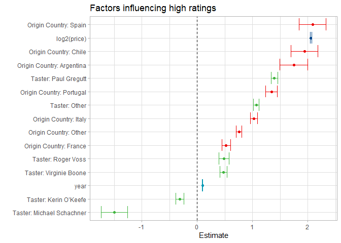

Wine Rating prediction
================
Stephan
Jul 13, 2021

 Photo by
<a href="https://unsplash.com/@kymellis?utm_source=unsplash&utm_medium=referral&utm_content=creditCopyText">Kym
Ellis</a> on
<a href="https://unsplash.com/s/photos/vineyard?utm_source=unsplash&utm_medium=referral&utm_content=creditCopyText">Unsplash</a>

# Exploration: Data

## Categorical variables

<!-- -->

# Coninouse Variables

<!-- -->

## Estimation of price vs point ratings

<!-- -->

<!-- -->

# Exploration: Lasso regression on words in description

Create LASSO regression for words used in high rating descriptions.
